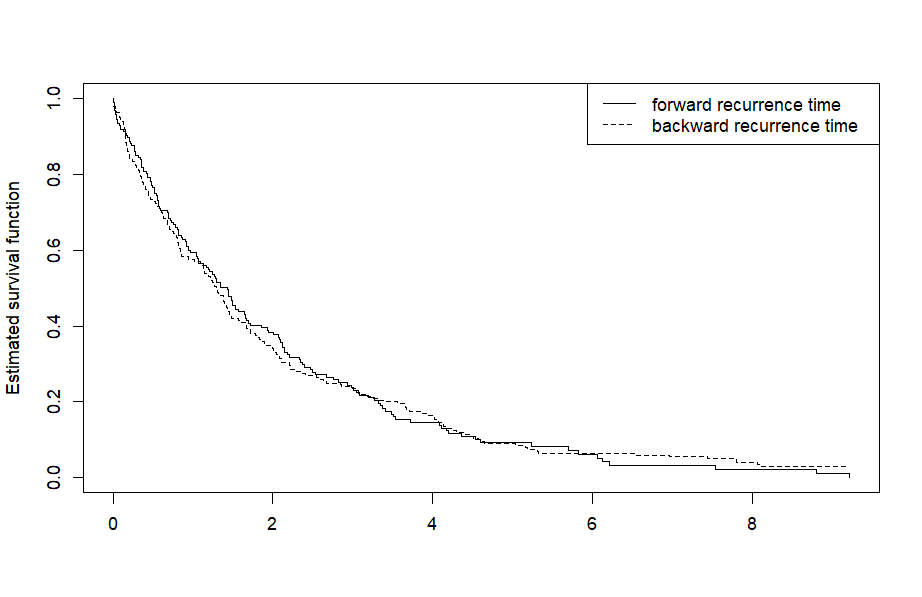
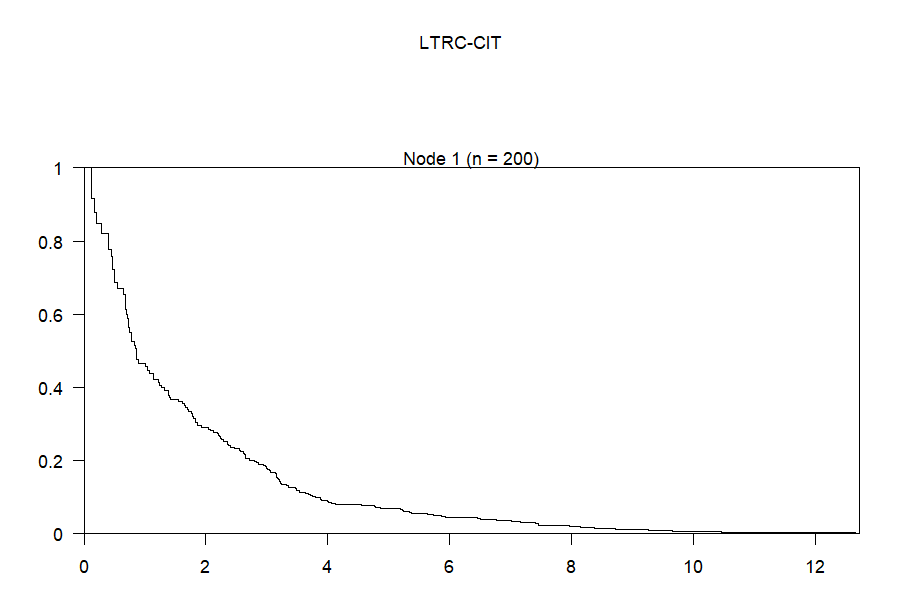
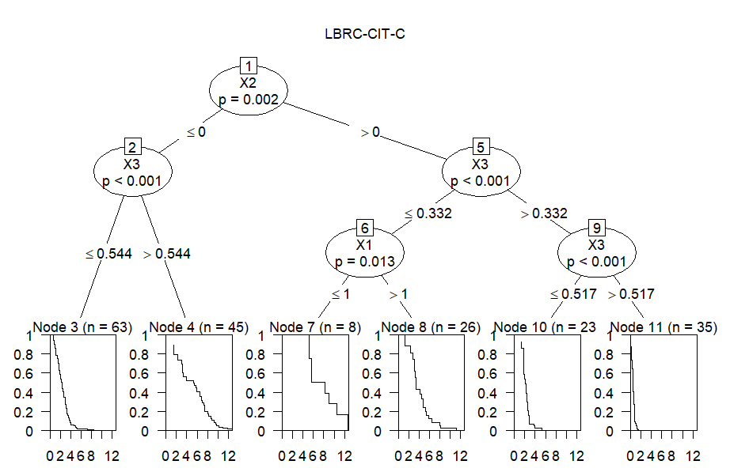
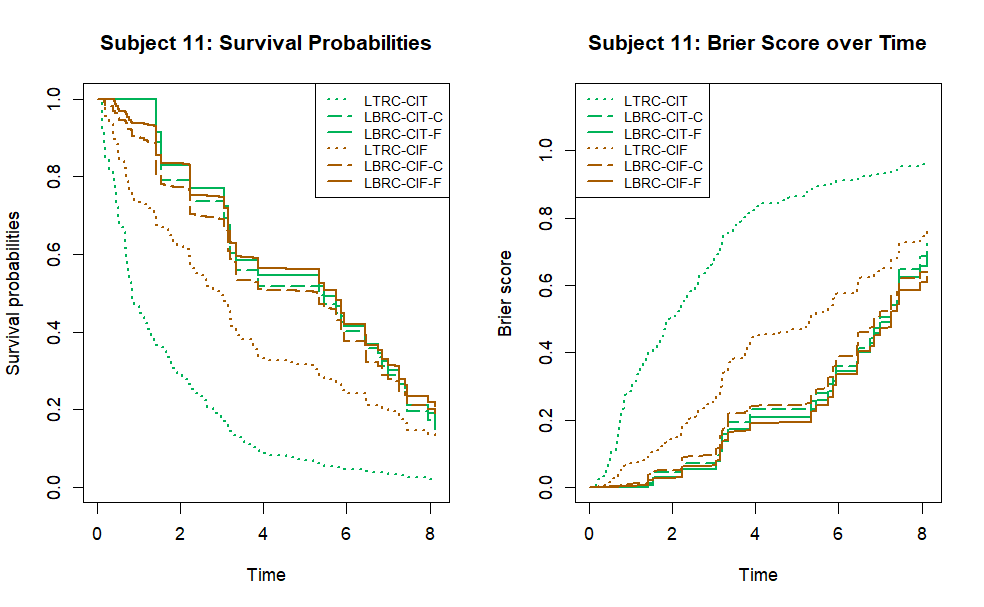
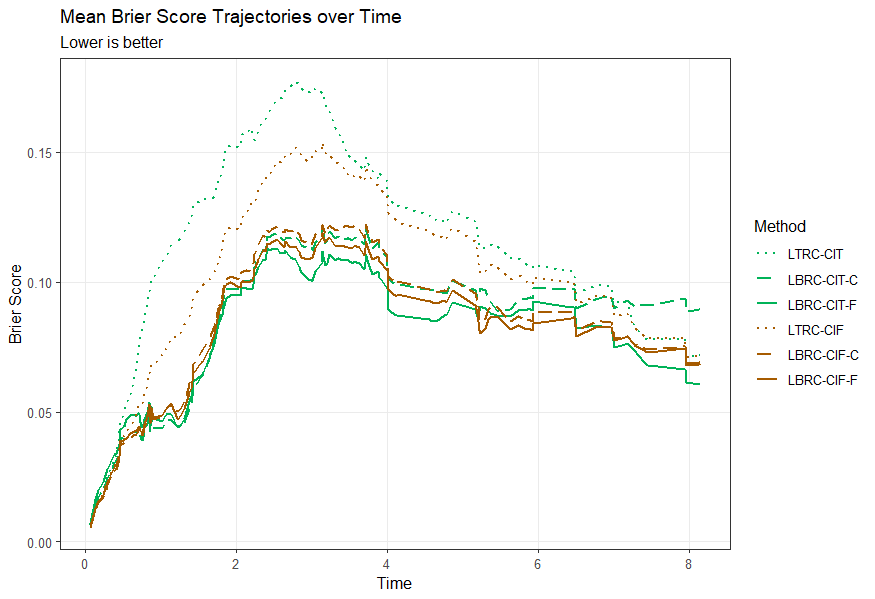

## Example Workflow

This example demonstrates how to evaluate the stationarity assumption, fit length-biased conditional inference trees (LBRC-CIT) and forests (LBRC-CIF), and evaluate their predictive performance for a specific subject using Brier Scores.

### 1. Installation & Data Preparation

Load the `lbrcforests` package along with the built-in dataset. 

```R
# devtools::install_github("jinwu99/LBRCtreeforests/pkg")
library(lbrcforests)
library(dplyr)
library(survival)
library(rsample)
library(ggplot2)

data("LBRC_example_data")
DATA <- LBRC_example_data

# Set seed to ensure reproducibility of bootstrap sampling and cross-validation.
set.seed(9999)
```

### 2. Stationarity Assumption Check

Before applying the length-biased methods, we verify the stationarity assumption using the archived `CoxPhLb` package.

```R
# if (!require("remotes")) install.packages("remotes")
# remotes::install_url("[https://cran.r-project.org/src/contrib/Archive/CoxPhLb/CoxPhLb_1.2.0.tar.gz](https://cran.r-project.org/src/contrib/Archive/CoxPhLb/CoxPhLb_1.2.0.tar.gz)")
library(CoxPhLb)

# a: backward recurrence time (left-truncation time)
# v: forward recurrence time (observed time - left-truncation time)
# delta: censoring indicator (0 = censored, 1 = event)
station.test(DATA$A, (DATA$Y - DATA$A), DATA$event)
station.test.plot(DATA$A, (DATA$Y - DATA$A), DATA$event)
```

```R
> station.test(DATA$A, (DATA$Y - DATA$A), DATA$event)
  test.statistic p.value
  -0.389         0.697
```



### 3. Define Prediction Horizon

To ensure stable estimation, we set the prediction horizon (`time.tau`) to the last time point where at least 10% of the subjects remain at risk.

```R
get_risk_set_info <- function(DATA, target_pct) {
  N_total <- nrow(DATA)
  unique_event_times <- sort(unique(DATA$Y[DATA$event == 1]))
  risk_set_df <- tibble(Time = unique_event_times) %>%
    rowwise() %>%
    mutate(N_Risk = sum(DATA$Y >= Time), Pct_Risk = (N_Risk / N_total) * 100) %>%
    ungroup()
  
  valid_times <- risk_set_df %>% filter(Pct_Risk >= target_pct)
  target_time_point <- ifelse(nrow(valid_times) > 0, max(valid_times$Time), NA)
  
  return(list(risk_set_df = risk_set_df, target_time = target_time_point))
}

time.tau <- get_risk_set_info(DATA = DATA, target_pct = 10)$target_time
time.eval <- sort(unique(c(0, DATA[DATA$Y < time.tau, "Y"])))
```

### 4. Model Fitting & Prediction

We formulate the survival model and fit both Tree (CIT) and Forest (CIF) models using three different survival estimators: KM (Benchmark), MFLE, and MCLE. We will predict the survival probabilities for subject `id == 11`.

```R
covariates <- setdiff(colnames(DATA), c("A", "Y", "event", "id"))
form <- as.formula(paste("Surv(A, Y, event) ~", paste(covariates, collapse = " + ")))
newdata <- DATA[DATA$id == 11, ]

# --- Trees (LBRC-CIT) ---
# KM (Benchmark)
obj_cit_km <- lbrccit(formula = form, data = DATA, perm_test_est = "KM") 
pred_cit_km <- predictProb_LBRC(obj_cit_km, newdata = newdata, newdata.id = id, time.eval = time.eval, time.tau = time.tau, pred_surv_est = "KM")
BS_cit_km <- sbrier_lbrc(obj = pred_cit_km$survival.obj, id = pred_cit_km$survival.id, pred = pred_cit_km, type = "BS")

# MFLE
obj_cit_mfle <- lbrccit(formula = form, data = DATA, perm_test_est = "MFLE")
pred_cit_mfle <- predictProb_LBRC(obj_cit_mfle, newdata = newdata, newdata.id = id, time.eval = time.eval, time.tau = time.tau, pred_surv_est = "MFLE")
BS_cit_mfle <- sbrier_lbrc(obj = pred_cit_mfle$survival.obj, id = pred_cit_mfle$survival.id, pred = pred_cit_mfle, type = "BS")

# MCLE
obj_cit_mcle <- lbrccit(formula = form, data = DATA, perm_test_est = "MCLE")
pred_cit_mcle <- predictProb_LBRC(obj_cit_mcle, newdata = newdata, newdata.id = id, time.eval = time.eval, time.tau = time.tau, pred_surv_est = "MCLE")
BS_cit_mcle <- sbrier_lbrc(obj = pred_cit_mcle$survival.obj, id = pred_cit_mcle$survival.id, pred = pred_cit_mcle, type = "BS")

# --- Forests (LBRC-CIF) ---
# KM (Benchmark)
obj_cif_km <- lbrccif(formula = form, data = DATA, ntree = 100, perm_test_est = "KM", pred_surv_est = "KM")
pred_cif_km <- predictProb_LBRC(obj_cif_km, newdata = newdata, newdata.id = id, time.eval = time.eval, time.tau = time.tau, pred_surv_est = "KM")
BS_cif_km <- sbrier_lbrc(obj = pred_cif_km$survival.obj, id = pred_cif_km$survival.id, pred = pred_cif_km, type = "BS")

# MFLE
obj_cif_mfle <- lbrccif(formula = form, data = DATA, ntree = 100, perm_test_est = "MFLE", pred_surv_est = "MFLE")
pred_cif_mfle <- predictProb_LBRC(obj_cif_mfle, newdata = newdata, newdata.id = id, time.eval = time.eval, time.tau = time.tau, pred_surv_est = "MFLE")
BS_cif_mfle <- sbrier_lbrc(obj = pred_cif_mfle$survival.obj, id = pred_cif_mfle$survival.id, pred = pred_cif_mfle, type = "BS")

# MCLE
obj_cif_mcle <- lbrccif(formula = form, data = DATA, ntree = 100, perm_test_est = "MCLE", pred_surv_est = "MCLE")
pred_cif_mcle <- predictProb_LBRC(obj_cif_mcle, newdata = newdata, newdata.id = id, time.eval = time.eval, time.tau = time.tau, pred_surv_est = "MCLE")
BS_cif_mcle <- sbrier_lbrc(obj = pred_cif_mcle$survival.obj, id = pred_cif_mcle$survival.id, pred = pred_cif_mcle, type = "BS")
```

### 5. Visualization

First, we can visualize the fitted tree structures to interpret the splitting rules and terminal node survival curves. 

```R
plot(obj_cit_km, main = "LTRC-CIT (KM Benchmark)")
plot(obj_cit_mfle, main = "LBRC-CIT-F (MFLE)")
plot(obj_cit_mcle, main = "LBRC-CIT-C (MCLE)")
```






Then, we plot the subject-specific survival probabilities and the Brier score over time for all models.

```R
par(mfrow = c(1, 2))

# Survival Probabilities Plot
plot(pred_cit_mcle$survival.probs ~ pred_cit_mcle$survival.times, type = "s", 
     col = "#00B358", lty = 5, lwd = 2, ylim = c(0, 1),
     xlab = "Time", ylab = "Survival probabilities", main = "Subject 11: Survival Probabilities")
lines(pred_cit_mfle$survival.probs ~ pred_cit_mfle$survival.times, type = "s", col = "#00B358", lty = 1, lwd = 2)
lines(pred_cit_km$survival.probs ~ pred_cit_km$survival.times, type = "s", col = "#00B358", lty = 3, lwd = 2)
lines(pred_cif_mcle$survival.probs ~ pred_cif_mcle$survival.times, type = "s", col = "#A65B00", lty = 5, lwd = 2)
lines(pred_cif_mfle$survival.probs ~ pred_cif_mfle$survival.times, type = "s", col = "#A65B00", lty = 1, lwd = 2)
lines(pred_cif_km$survival.probs ~ pred_cif_km$survival.times, type = "s", col = "#A65B00", lty = 3, lwd = 2)
legend("topright", legend = c("LTRC-CIT", "LBRC-CIT-C", "LBRC-CIT-F", 
                             "LTRC-CIF", "LBRC-CIF-C", "LBRC-CIF-F"), 
       col = c(rep("#00B358", 3), rep("#A65B00", 3)), lty = c(3, 5, 1, 3, 5, 1), lwd = 2, cex = 0.8)


# Brier Score Plot
plot(BS_cit_mcle$BScore ~ BS_cit_mcle$Time, type = "s", 
     col = "#00B358", lty = 5, lwd = 2, ylim = c(0, max(BS_cit_km$BScore, na.rm=TRUE) * 1.2),
     xlab = "Time", ylab = "Brier score", main = "Subject 11: Brier Score over Time")
lines(BS_cit_mfle$BScore ~ BS_cit_mfle$Time, type = "s", col = "#00B358", lty = 1, lwd = 2)
lines(BS_cit_km$BScore ~ BS_cit_km$Time, type = "s", col = "#00B358", lty = 3, lwd = 2)
lines(BS_cif_mcle$BScore ~ BS_cif_mcle$Time, type = "s", col = "#A65B00", lty = 5, lwd = 2)
lines(BS_cif_mfle$BScore ~ BS_cif_mfle$Time, type = "s", col = "#A65B00", lty = 1, lwd = 2)
lines(BS_cif_km$BScore ~ BS_cif_km$Time, type = "s", col = "#A65B00", lty = 3, lwd = 2)
legend("topleft", legend = c("LTRC-CIT", "LBRC-CIT-C", "LBRC-CIT-F", 
                                "LTRC-CIF", "LBRC-CIF-C", "LBRC-CIF-F"),
       col = c(rep("#00B358", 3), rep("#A65B00", 3)), lty = c(3, 5, 1, 3, 5, 1), lwd = 2, cex = 0.8)
```



### 6. 5-Fold Cross-Validation (Model Validation)

To rigorously evaluate the predictive performance of the models, we perform a 5-fold cross-validation. We evaluate the overall predictive accuracy using the Integrated Brier Score (IBS) and track the model's stability over time by plotting the Brier Score Trajectories.

```R
cv_folds <- vfold_cv(DATA, v = 5)

# Common time grid for averaging Brier Scores across folds
plot_grid <- sort(unique(DATA$Y[DATA$Y <= time.tau]))

# Helper function: Interpolate Brier scores onto the common grid
interpolate_brier <- function(brier_df, plot_grid) {
  if (is.null(brier_df) || nrow(brier_df) < 2) return(rep(NA_real_, length(plot_grid)))
  approx(x = brier_df$Time, y = brier_df$BScore, xout = plot_grid, rule = 2)$y
}

# Initialize empty dataframes to store results
ibs_results <- data.frame()
bs_results <- data.frame()

# Run the Cross-Validation Loop
for (i in seq_len(nrow(cv_folds))) {
  cat(sprintf("Processing Fold %d / 5...\n", i))
  
  # Split into training and testing cohorts
  split <- cv_folds$splits[[i]]
  TRAIN <- analysis(split)
  TEST  <- assessment(split)
  TEST$id <- seq_len(nrow(TEST))
  
  time.eval <- sort(unique(c(0, TEST$Y[TEST$Y <= time.tau])))
  test_surv_obj <- survival::Surv(TEST$A, TEST$Y, TEST$event)
  
  # --- Fit LBRC-CIT (Tree) Models ---
  # KM (Benchmark)
  fit_cit_km <- lbrccit(form, data = TRAIN, perm_test_est = "KM")
  pred_cit_km <- predictProb_LBRC(fit_cit_km, newdata = TEST, newdata.id = id, time.eval = time.eval, time.tau = rep(time.tau, nrow(TEST)), pred_surv_est = "KM")
  ibs_cit_km <- sbrier_lbrc(test_surv_obj, id = TEST$id, pred = pred_cit_km, type = "IBS")
  bs_cit_km <- sbrier_lbrc(test_surv_obj, id = TEST$id, pred = pred_cit_km, type = "BS")
  cat("LTRC-CIT finished\n")
  
  # MFLE (Proposal)
  fit_cit_mfle <- lbrccit(form, data = TRAIN, perm_test_est = "MFLE")
  pred_cit_mfle <- predictProb_LBRC(fit_cit_mfle, newdata = TEST, newdata.id = id, time.eval = time.eval, time.tau = rep(time.tau, nrow(TEST)), pred_surv_est = "MFLE")
  ibs_cit_mfle <- sbrier_lbrc(test_surv_obj, id = TEST$id, pred = pred_cit_mfle, type = "IBS")
  bs_cit_mfle <- sbrier_lbrc(test_surv_obj, id = TEST$id, pred = pred_cit_mfle, type = "BS")
  cat("LBRC-CIT-F finished\n")
  
  # MCLE (Proposal)
  fit_cit_mcle <- lbrccit(form, data = TRAIN, perm_test_est = "MCLE")
  pred_cit_mcle <- predictProb_LBRC(fit_cit_mcle, newdata = TEST, newdata.id = id, time.eval = time.eval, time.tau = rep(time.tau, nrow(TEST)), pred_surv_est = "MCLE")
  ibs_cit_mcle <- sbrier_lbrc(test_surv_obj, id = TEST$id, pred = pred_cit_mcle, type = "IBS")
  bs_cit_mcle <- sbrier_lbrc(test_surv_obj, id = TEST$id, pred = pred_cit_mcle, type = "BS")
  cat("LBRC-CIT-C finished\n")
  
  # --- Fit LBRC-CIF (Forest) Models ---
  # KM (Benchmark)
  fit_cif_km <- lbrccif(form, data = TRAIN, ntree = 30, perm_test_est = "KM", pred_surv_est = "KM", trace = FALSE)
  pred_cif_km <- predictProb_LBRC(fit_cif_km, newdata = TEST, time.eval = time.eval, time.tau = rep(time.tau, nrow(TEST)), pred_surv_est = "KM")
  ibs_cif_km <- sbrier_lbrc(test_surv_obj, id = TEST$id, pred = pred_cif_km, type = "IBS")
  bs_cif_km <- sbrier_lbrc(test_surv_obj, id = TEST$id, pred = pred_cif_km, type = "BS")
  cat("LTRC-CIF finished\n")
  
  # MFLE (Proposal)
  fit_cif_mfle <- lbrccif(form, data = TRAIN, ntree = 30, perm_test_est = "MFLE", pred_surv_est = "MFLE", trace = FALSE)
  pred_cif_mfle <- predictProb_LBRC(fit_cif_mfle, newdata = TEST, time.eval = time.eval, time.tau = rep(time.tau, nrow(TEST)), pred_surv_est = "MFLE")
  ibs_cif_mfle <- sbrier_lbrc(test_surv_obj, id = TEST$id, pred = pred_cif_mfle, type = "IBS")
  bs_cif_mfle <- sbrier_lbrc(test_surv_obj, id = TEST$id, pred = pred_cif_mfle, type = "BS")
  cat("LBRC-CIF-F finished\n")
  
  # MCLE (Proposal)
  fit_cif_mcle <- lbrccif(form, data = TRAIN, ntree = 30, perm_test_est = "MCLE", pred_surv_est = "MCLE", trace = FALSE)
  pred_cif_mcle <- predictProb_LBRC(fit_cif_mcle, newdata = TEST, time.eval = time.eval, time.tau = rep(time.tau, nrow(TEST)), pred_surv_est = "MCLE")
  ibs_cif_mcle <- sbrier_lbrc(test_surv_obj, id = TEST$id, pred = pred_cif_mcle, type = "IBS")
  bs_cif_mcle <- sbrier_lbrc(test_surv_obj, id = TEST$id, pred = pred_cif_mcle, type = "BS")
  cat("LBRC-CIF-C finished\n")
  
  # --- Store Fold Results ---
  # Store IBS
  fold_ibs <- data.frame(
    Fold = i,
    Method = c("LTRC-CIT", "LBRC-CIT-F", "LBRC-CIT-C", "LTRC-CIF", "LBRC-CIF-F", "LBRC-CIF-C"),
    IBS = c(ibs_cit_km, ibs_cit_mfle, ibs_cit_mcle, ibs_cif_km, ibs_cif_mfle, ibs_cif_mcle)
  )
  ibs_results <- bind_rows(ibs_results, fold_ibs)
  
  # Store Interpolated Brier Score Trajectories
  fold_bs <- data.frame(
    Fold = i,
    Method = rep(c("LTRC-CIT", "LBRC-CIT-F", "LBRC-CIT-C", "LTRC-CIF", "LBRC-CIF-F", "LBRC-CIF-C"), each = length(plot_grid)),
    Time = rep(plot_grid, 6),
    BScore = c(
      interpolate_brier(bs_cit_km, plot_grid), interpolate_brier(bs_cit_mfle, plot_grid), interpolate_brier(bs_cit_mcle, plot_grid),
      interpolate_brier(bs_cif_km, plot_grid), interpolate_brier(bs_cif_mfle, plot_grid), interpolate_brier(bs_cif_mcle, plot_grid)
    )
  )
  bs_results <- bind_rows(bs_results, fold_bs)
}
```

### 7. CV Performance Summary & Visualizations

Finally, we summarize the cross-validated results by calculating the mean and standard deviation of the Integrated Brier Scores (IBS), and generate a trajectory plot showing the mean Brier Scores over time.

```R
method_levels <- c("LTRC-CIT", "LBRC-CIT-C", "LBRC-CIT-F", "LTRC-CIF", "LBRC-CIF-C", "LBRC-CIF-F")
method_colors <- c("LTRC-CIT" = "#00B358", "LBRC-CIT-C" = "#00B358", "LBRC-CIT-F" = "#00B358", 
                   "LTRC-CIF" = "#A65B00", "LBRC-CIF-C" = "#A65B00", "LBRC-CIF-F" = "#A65B00")
method_linetypes <- c("LTRC-CIT" = "dotted", "LBRC-CIT-C" = "longdash", "LBRC-CIT-F" = "solid", 
                      "LTRC-CIF" = "dotted", "LBRC-CIF-C" = "longdash", "LBRC-CIF-F" = "solid")
ibs_results$Method <- factor(ibs_results$Method, levels = method_levels)
bs_results$Method <- factor(bs_results$Method, levels = method_levels)

bs_summary <- bs_results %>%
  group_by(Method, Time) %>%
  summarise(Mean_BScore = mean(BScore, na.rm = TRUE), .groups = "drop")
p_trajectory <- ggplot(bs_summary, aes(x = Time, y = Mean_BScore, color = Method, linetype = Method)) +
  geom_line(linewidth = 0.8) +
  scale_color_manual(values = method_colors) +
  scale_linetype_manual(values = method_linetypes) +
  labs(title = "Mean Brier Score Trajectories over Time", subtitle = "Lower is better", x = "Time", y = "Brier Score") +
  theme_bw() +
  theme(legend.position = "right", panel.grid.minor = element_blank())
print(p_trajectory)

ibs_summary <- ibs_results %>% 
  group_by(Method) %>% 
  summarise(Mean_IBScore = mean(IBS, na.rm = TRUE), 
            SD_IBScore = sd(IBS, na.rm = TRUE), .groups = "drop")
print(ibs_summary)
```



```R
> print(ibs_summary)
# A tibble: 6 × 3
  Method     Mean_IBScore SD_IBScore
  <fct>             <dbl>      <dbl>
1 LTRC-CIT         0.117      0.0452
2 LBRC-CIT-C       0.0887     0.0189
3 LBRC-CIT-F       0.0813     0.0171
4 LTRC-CIF         0.104      0.0372
5 LBRC-CIF-C       0.0863     0.0225
6 LBRC-CIF-F       0.0832     0.0221
```
